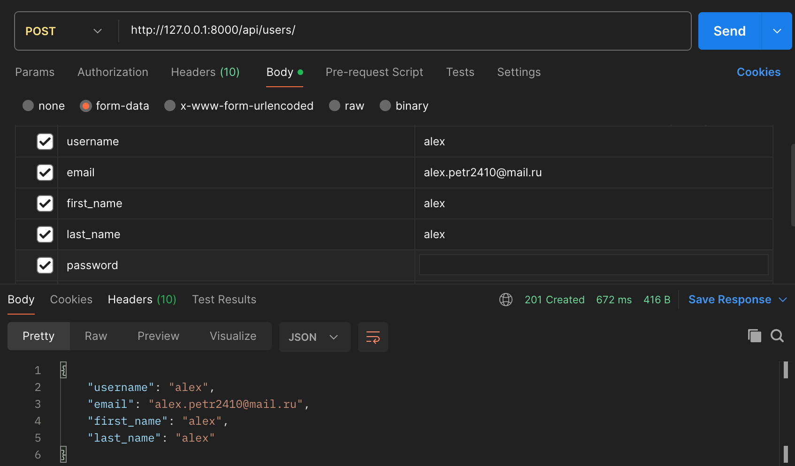
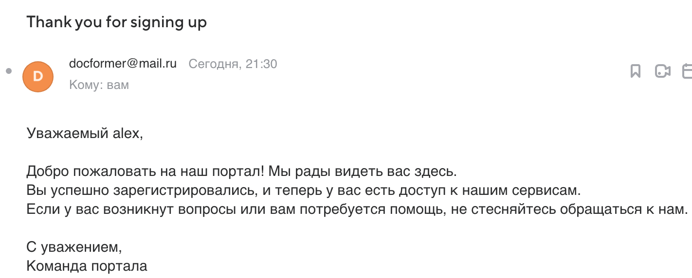
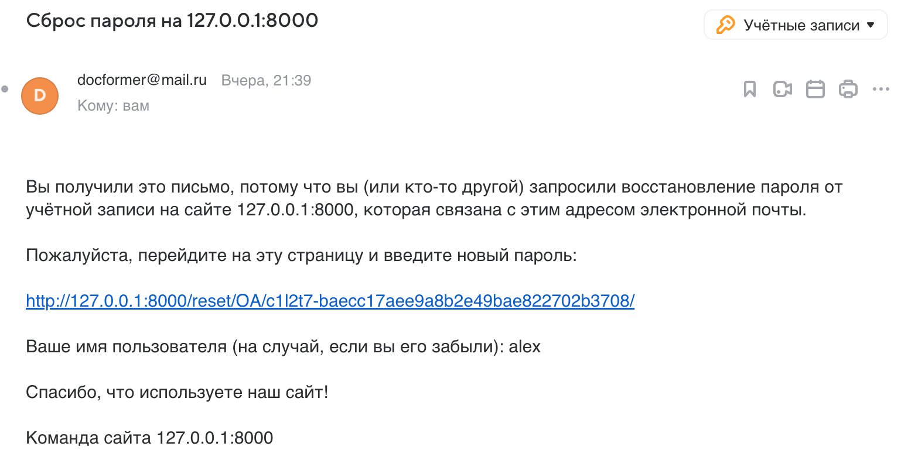
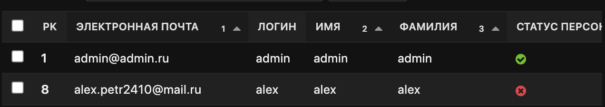
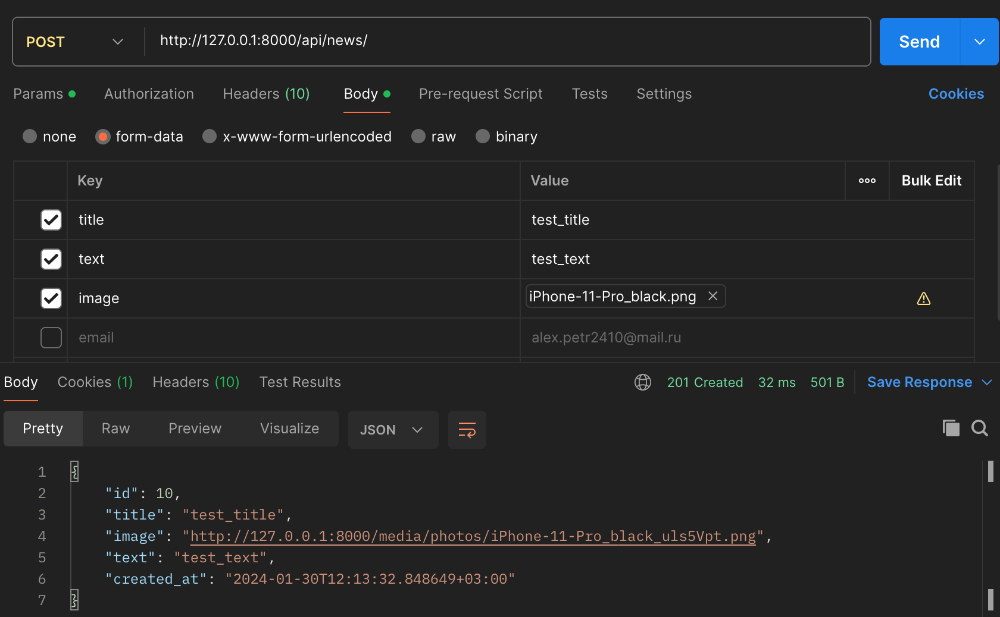
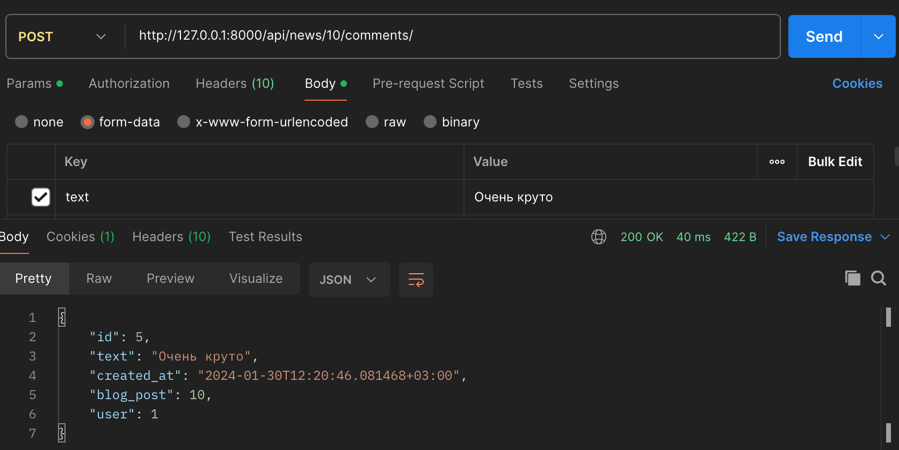
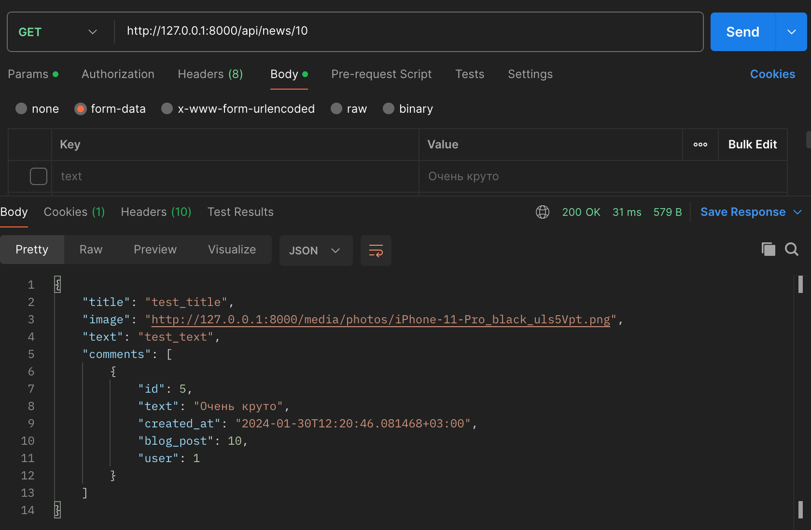
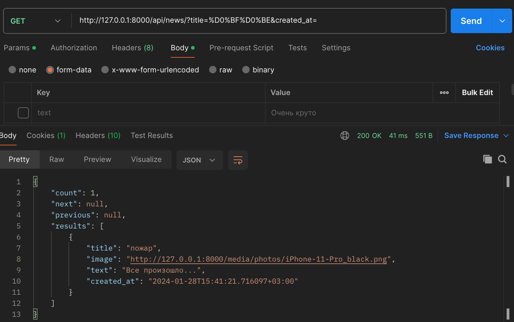
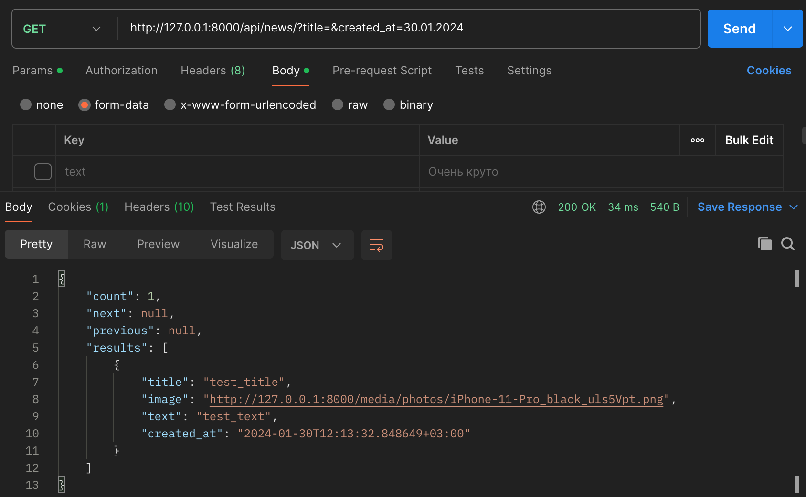
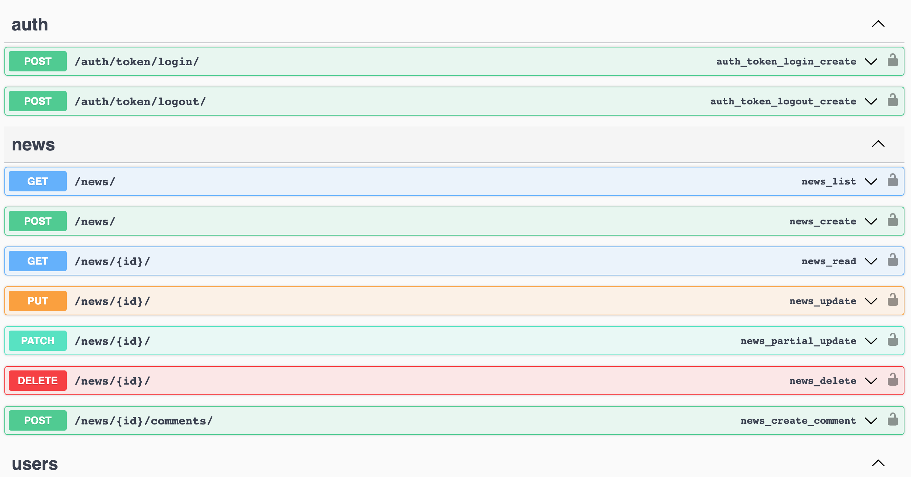

# Буря идей, волнение вдохновения: ваш личный поток мыслей в МыслиВслух

## Развертывание проекта

1. Сделать клон проекта "https://github.com/AppleIpx/news-feed.git"
2. Cоздать виртуальное окружение "python3  -m venv venv" и активировать его "source venv/bin/activate"
3. Установить библиотеки с requirements.txt "pip install -r requirements.txt"
4. Ввести данные вашей электронной почты и SECRET_KEY в (backend/news_feed/settings.py), образец находится в infra/.env.example
5. Выполнить миграции находясь в директории backend "python manage.py migrate"
6. Создать супер пользователя (админ) "python manage.py createsuperuser"
7. Запустить локальный сервер "python manage.py runserver"
8. Зайти в панель администратора 127.0.0.1:8000/admin, используя логин и пароль введенные при создании супер пользователя

## Техническое задание (ТЗ)

## 1. Введение

### 1.1 Описание проекта

Приложение "МыслиВслух" предназначено для создания уникальных и интересных личных блогов, где пользователи могут 
свободно выражать свои мысли, идеи и чувства. Оно предоставляет платформу, где каждый может поделиться 
своим внутренним миром, находить вдохновение в мыслях других и оставлять комментарии. "МыслиВслух" создано 
для того, чтобы стимулировать творчество, обмен опытом и построение сообщества, где каждая мысль имеет свое место и значение.

### 1.2 Контекст проекта

Возникла идея создать приложение "МыслиВслух", чтобы удовлетворить потребность в креативном самовыражении и обмене 
мыслями, предоставляя уникальное пространство для пользователей выражать свои идеи и взгляды в личных блогах.

## 2. Требования

### 2.1 Функциональные требования

#### 2.1.1 Основные функции

- Регистрация и аутентификация пользователей.
- Отправка email письма при регистрации пользователя.
- Создана форма сброса пароля пользователя, отправкой email письма.
- Создание, редактирование и удаление постов.
- Оставление комментариев под конкретным постом
- Поиск постов по названию и дате.
- Интеграция Swagger для удобной документации API и взаимодействия с ним.
- Реализована защита от множественных запросов от анонимов (50 запросов) и авторизированных пользователей (100 запросов)
для предотвращения злоупотреблений и улучшения общей производительности системы.

## 3. Архитектура

### 3.1 Архитектурные решения

- Backend: Django с использованием Django REST framework.
- Backend: Отправка писем асинхронно с использованием Celery и Redis
- База данных: SqLite3

### 3.2 База данных

- База данных будет содержать таблицы для пользователей, постов и комментариев.

## 4. Разработка

### 4.1 План разработки

- Этап 1: Проектирование базы данных и бэкенда.
- Этап 2: Тестирование и отладка.
- Этап 3: Релиз и развертывание.

### 4.2 Ресурсы и инструменты

- Python, Django, Django REST framework, Celery, Redis, Djoser, для бэкенда.
- Инструменты для тестирования - unit test.

## 5. Тестирование

### 5.1 План тестирования

- Тестирование функциональности регистрации и аутентификации пользователей.
- Тестирование создания постов и комментариев к ним.

### Результат работы:

## Авторизация и Регистрация:

- Пользователи могут создавать учетные записи и входить в систему.
.
- При регистрации пользователи получают email письмо.
.
- Если пользователь забыл пароль, он может его восстановить, инструкция придет по email.
.
- Пользователи разделяются на администраторов и обычных пользователей.
.

## Посты:

- Пользователи могут создавать, редактировать и удалять свои посты.
.
- Пользователи могут оставлять комментарии под поставми.
.
- Просмотр оставленного комментария.
.
- Пользователи могут фильтровать посты по их названию. Введем "по"
.
- Фильтрация по дате. Введем 29.01.2024.
.

## Документация

- документация доступка по адресу "127.0.0.1:8000/swagger/".
.

